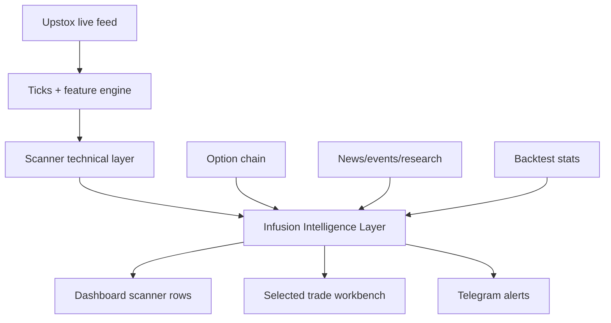

# Infusion Intelligence Layer — Implementation Plan

## Objective

Turn the dashboard from a raw F&O scanner into a decision-support engine that explains:

- whether a stock is suitable for intraday, swing, both, or avoid;
- where the stock becomes bullish or bearish;
- whether the option contract is realistic enough to trade;
- why the setup is strong;
- why the setup should be rejected or delayed;
- which evidence source is currently driving the view.

This plan adapts the useful ideas from the reviewed open-source repositories without directly copying fragile or outdated trading code.

## Repo review decisions

| Source | Adopt | Avoid |
|---|---|---|
| maanavshah/stock-market-india | Market pulse concepts: gainers, losers, breadth, 52-week levels, top volume/value | Direct NSE scraping as primary live feed |
| we-shall/Stock-Prediction | News-impact-by-volume, breakpoint logic, stock/news mapping, correlation thinking | News sentiment as direct buy/sell signal |
| janithmehta/StockMarketPrediction | Feature-engineering ideas: momentum, moving averages, fundamentals as swing context | Old Lasso/SVM price forecasting for live options |
| samyakjain0606/awesome-stock-skills | Swing research triggers, variant perception, concall/event context | Slow research signals as intraday entries |
| StockSharp/StockSharp | Backtest lifecycle, strategy runner architecture, reports, performance statistics | Direct C# platform integration into current Python/JS stack |

## Architecture

## Score model

### 1. Intraday score

Fast same-day tradability:

- VWAP position
- EMA/MACD/RSI alignment
- relative volume
- MTF fast alignment
- anti-chase quality
- breakout proximity

### 2. Swing score

Carry potential:

- 1H/4H/1D alignment
- sector support
- compression/base quality
- clean risk line
- event/news/research context

### 3. Options execution score

Whether the option is worth touching:

- CE/PE directional bias
- option chain readiness
- spread
- OI/volume
- IV/expiry risk
- premium risk versus capital
- target clearing breakeven

## Decision output

Each stock should eventually expose:

- `trade_decision`: BUY CE / BUY PE / HOLD / AVOID
- `trade_horizon`: INTRADAY / BTST_1_2D / SWING / BOTH / AVOID
- `positive_above`
- `negative_below`
- `entry_price_hint`
- `stop_loss_hint`
- `target_1_hint`
- `target_2_hint`
- `risk_reward_ratio_hint`
- `sustain_rule`
- `breakout_explanation`
- `strength_reasons`
- `rejection_reasons`
- `intelligence_summary`
- `intelligence_layer`

## Phases

### Phase 1 — Intelligence contract and visible scanner summary

Status: Implemented in this pass.

- Add a reusable API intelligence helper.
- Standardize intraday/swing/options/research/news/backtest sub-scores.
- Add source labels showing whether a field is live, proxy, pending, or historical.
- Add compact dashboard “Intel” column.
- Keep auto-ordering disabled.

### Phase 2 — News + event confirmation

Status: Implemented in v5.8.1.

- Add selected-stock public-news cache.
- Classify news as bullish, bearish, neutral, or event risk.
- Score news only when volume and price confirm.
- Show confirmed / unconfirmed / conflicting / event risk / no-news state in scanner rows.
- Combine manual event calendar with the intelligence layer as a hard/soft blocker.

### Phase 3 — Real option-chain scoring

Status: Implemented in v5.8.2.

- Use Upstox option chain and Greek fields.
- Score spread, OI, volume, IV, expiry, delta zone, premium risk.
- Replace proxy option score with contract-level score.
- Keep raw chain score visible, but cap execution score when IV history,
  spread, breakeven, liquidity, physical-settlement, or event blockers make
  the contract unsuitable for actual option buying.
- Cache selected Upstox chain summaries back into scanner rows so F&O ranking
  can use realistic contract readiness instead of only underlying proxy score.

### Phase 3.1 — Smart option-chain refresh queue

Status: Implemented in v5.8.3.

- Auto-refresh Upstox option chains only for high-priority candidates:
  active signals, pre-breakout leaders, and high-momentum F&O rows.
- Avoid brute-force option-chain calls for all 208 F&O stocks every cycle.
- Add per-symbol refresh locks so the dashboard does not repeatedly hammer the
  same contract.
- Persist queue status at `/api/options/queue/status` and show compact `ChainQ`
  diagnostics in the footer.
- Scanner rows automatically switch from proxy option readiness to real chain
  execution score when the queue refreshes that symbol.

### Phase 4 — Historical MTF and swing module

Status: Implemented in v5.9.0.

- Build real 1D/4H/1H/15M/5M features from historical candles.
- Add swing setup cards.
- Add catalyst and sector trigger context.
- Warm historical MTF cache automatically for ranked F&O candidates.
- Use fast historical MTF for intraday chaseability and 1H/4H/1D for swing
  carry quality.
- Add practical option-target floor before option-chain breakeven scoring so
  tiny legacy targets do not incorrectly block all contracts.

### Phase 4.1 — Dual scanner/MTF trade maps

Status: Implemented in v5.9.1.

- Keep the scanner-primary trade map independent from historical MTF bias.
- When scanner side and historical MTF side disagree, show a separate
  `mtf_alternate_trade_map` instead of mixing CE and PE entry/target/SL levels.
- Expose `mtf_conflict` and `mtf_conflict_note` so the UI can clearly explain
  that the alternate side needs its own trigger confirmation.
- Show Primary Trade Map and MTF Alternate Map inside the selected F&O screener
  row for faster visual decision-making.

### Phase 5 — Backtest and validation console

Status: Phase 5 foundation implemented in v5.9.2.

- Backtest every strategy profile.
- Show win rate, average R:R, max drawdown, sample size, slippage-adjusted result.
- Promote only proven rules into alert mode.
- Added walk-forward out-of-sample validation:
  - older archived outcomes are used as the training window;
  - newer archived outcomes are used as the forward test window;
  - the dashboard shows train precision, forward precision, sample size, and
    overfit gap;
  - profiles that only look good in-sample are not treated as approved.

### Phase 6 — Alert and execution discipline

Status: Phase 6 alert foundation implemented in v5.9.3.

- Telegram alerts include entry, SL, T1/T2, option contract, blockers, and confidence source.
- Add paper-trade validation before any live auto-execution.
- Alerts now include:
  - primary scanner trade map;
  - historical MTF alternate map when scanner and MTF disagree;
  - conflict note so CE/PE levels are not mixed;
  - horizon and chase quality;
  - anti-chase and rejection reasons;
  - Upstox option-chain contract reality when cached;
  - explicit paper-first execution mode warning.
- Phase 6.1 added a safe Telegram test-alert endpoint and dashboard button:
  - `/api/alerts/test` publishes a marked `test_alert` event;
  - alerter bypasses cooldown/quality gates only for this marked test event;
  - archiver skips `test_alert`, so precision/backtest stats remain clean;
  - Alert Log shows the delivery outcome.
- Phase 6.2 added alert preview and rate visibility:
  - `/api/alerts/test/preview` shows the exact sample alert content without
    sending Telegram;
  - Alert Log shows preview chips for symbol, side, entry, SL, targets, and
    test-only safety;
  - Alert Log also shows hourly, burst, and delivery-log counts before sending.

## Safety rule

No live auto-order placement should be enabled until:

- option-chain scoring is live;
- backtest sample size is sufficient;
- paper-trade journal confirms repeatability;
- daily loss guard and kill switch are tested.
